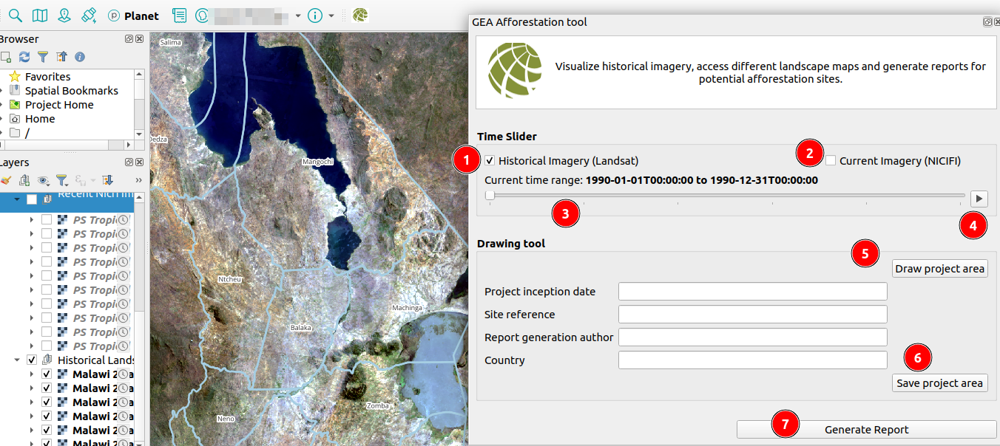
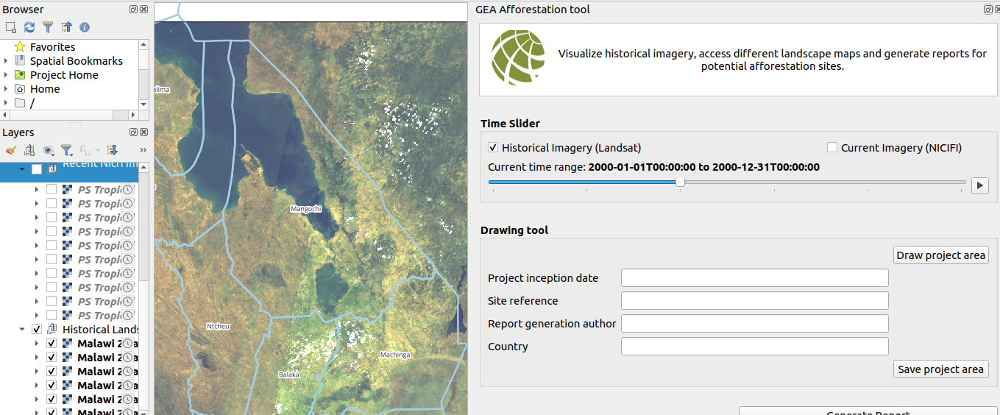
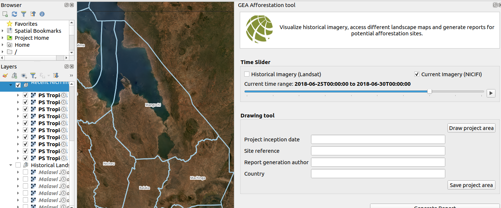

# GEA Re-Afforestation Tool User Manual

Welcome to the GEA Re-Afforestation Tool user manual. This guide will help you navigate and utilise the tool to visualise historical imagery, access different landscape maps, and generate reports for potential afforestation sites.

## Overview

The GEA Re-Afforestation Tool is designed to assist users in identifying and evaluating potential afforestation sites by providing access to various historical and current landscape imagery. Key features of the tool include:

- Visualisation of historical imagery (Landsat)
- Visualisation of current imagery (NICFI)
- Interactive map canvas
- Report generation for potential afforestation sites

**Features and Controls**

1. **Historical Imagery (Landsat):** If checked the map canvas will display historical imagery from Landsat.

2. **Current Imagery (NICFI):** If checked the map canvas will display current imagery from NICFI.

3. **Slide Bar:** The slide bar allows users to view the selected imagery on the map canvas. The functionality of the slide bar depends on the checkbox selection:

    - **Historical Imagery Checkbox Checked:** The map canvas will display historical imagery from Landsat.

    

    - **Current Imagery Checkbox Checked:** The map canvas will display current imagery from NICFI.

    

    The user can use the slide bar by dragging the toggle to the next or previous increment to view the corresponding imagery on the map canvas.

4. **Play Button:** The play button allows users to play through the selected imagery. This feature is useful for visualising changes in the landscape over time.

    **Historical Imagery**

    

    **Current Imagery**

    

