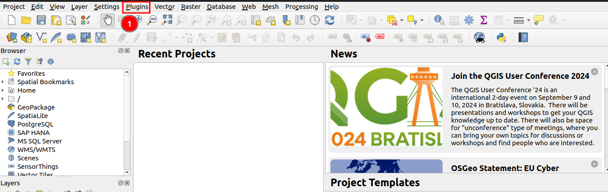
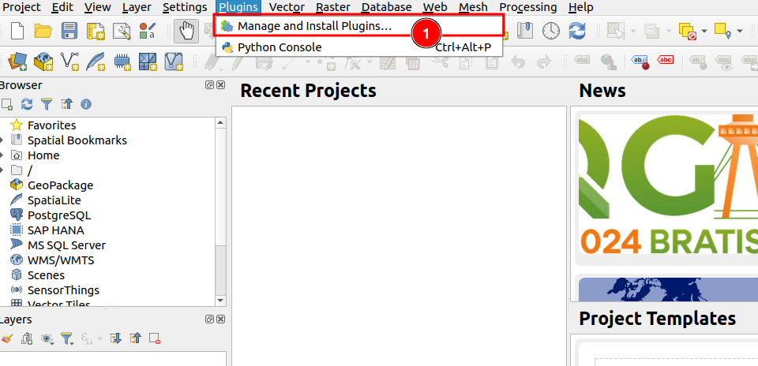
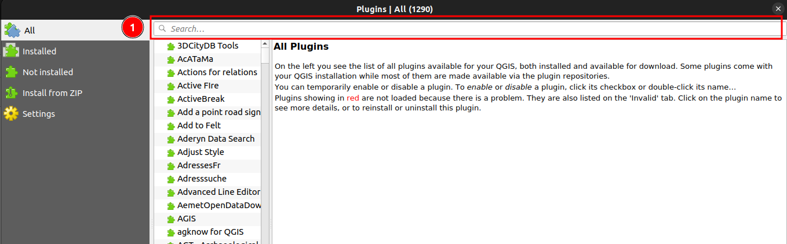
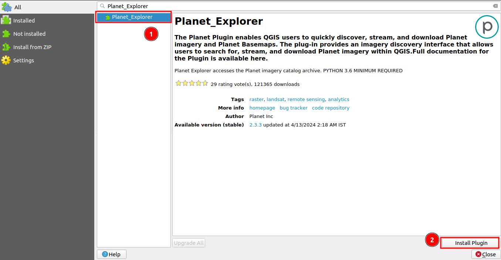
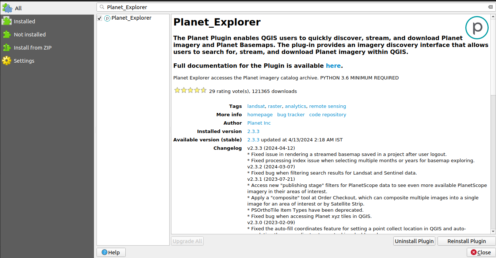
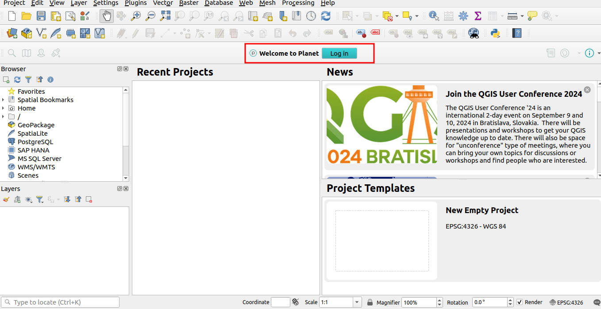
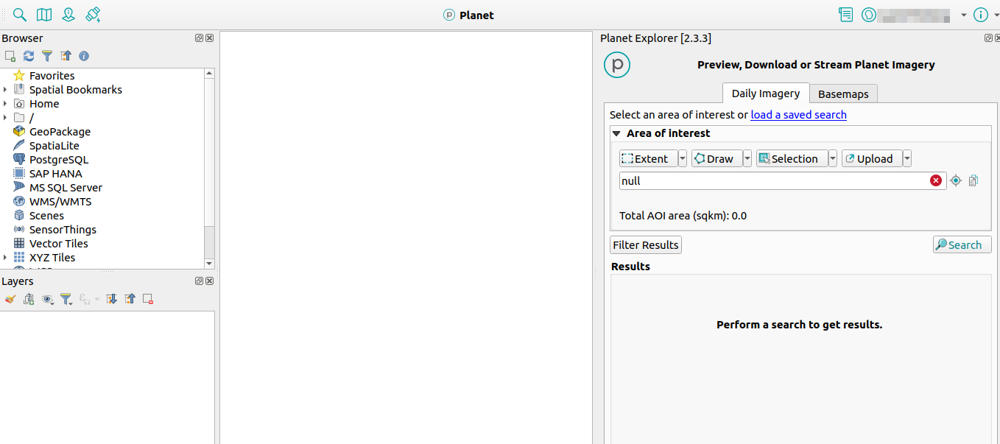
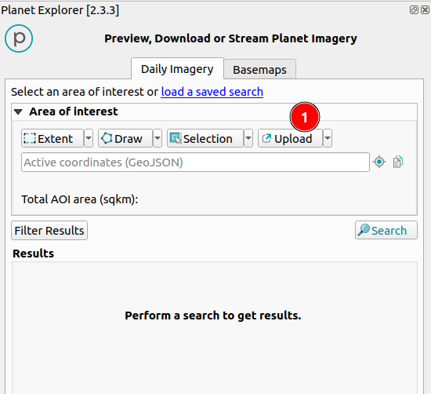
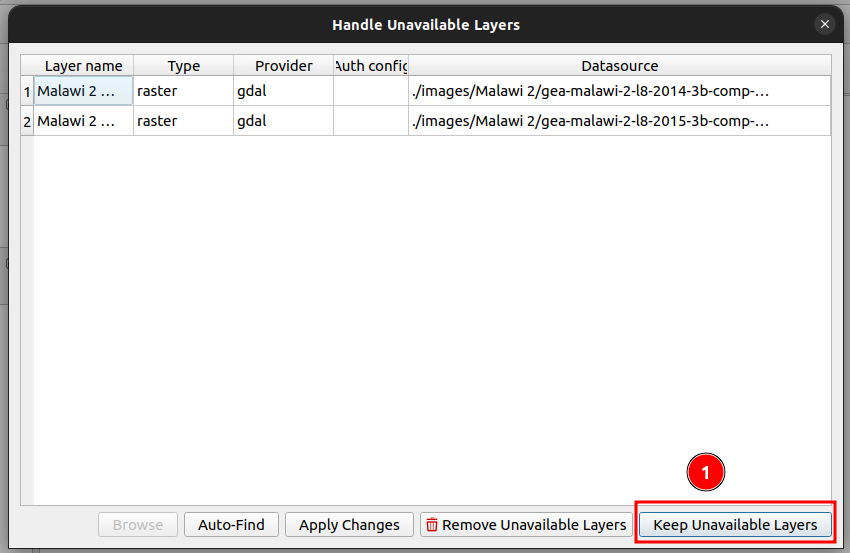
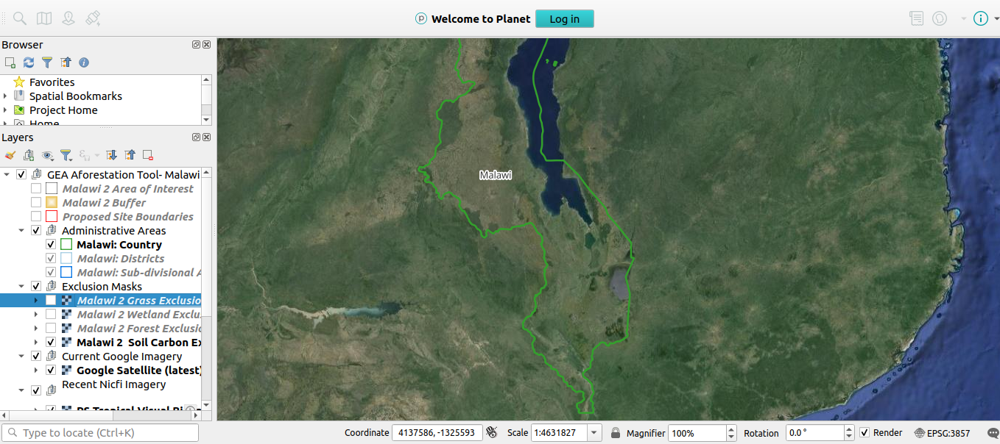

# Quick Start Guide: QGIS-GEA Plugin

## Introduction

The GEA Re-Afforestation Tool consists of two main components:

1. A QGIS project that contains all the data for the area of interest, such as Malawi.
2. The GEA Re-Afforestation Plugin helps users easily view current, recent, and historical imagery of an area and conveniently draw boundaries for proposed re-afforestation projects.

To use the tool, a few dependencies are required:

1. QGIS: The tool runs in QGIS geographical software, which needs to be installed on the user's computer.
2. A free Account for NICFI data: https://www.planet.com/nicfi
3. Planet_explorer: Some data (e.g., NICFI imagery) is streamed in via the Planet plugin, so this plugin needs to be installed in QGIS.

The following Quick Start documentation will guide users on how to set up the tool with its dependencies: 

1. Get QGIS
2. The project file for an area of interest
3. Sign in for a Planet NICFI account
4. get the Plantet_Explorer Plugin
5. get the GEA Re-Afforestation Plugin

## Steps to Install the Plugin

- **Open QGIS:** Launch the QGIS application on your computer.

- **Access the Plugins Menu:** Click on the 1️⃣ `Plugins` option available in the navbar section at the top of the QGIS window. Upon clicking you will see the other option for plugin.

- **Manage and Install Plugins** Select the 1️⃣ `Manage and Install Plugins..` option from the dropdown menu.

- **Search for the Plugin:** In the Plugin Manager window, click on the 1️⃣ search bar and type Planet_explorer.

- **Select and Install:** Once you find the Planet_explorer plugin in the search results, select it by clicking on the 1️⃣ `Planet_Explorer` and then click on the 2️⃣ `Install Plugin` button.

After the installation, you will see the login option.

After installing the plugin you will see the option for login to the `Planet Explorer` site. register to the site and log in to view Norway’s International Climate & Forests Initiative (NICFI), imagery.

Click on the [sign-up](../manual/sign-up.md) to view the detailed documentation on how to sign up on the `Planet Explorer` site.

Click on the [login](../manual/login.md) to view the detailed documentation on how to log in on the `Planet Explorer` site.

## Login

Click on the login button and login to the planet explorer. Upon logging in you will see options like upload, draw, select or extent layers.

## Accessing Project Data

- **Project Folder Delivery:** You need to ask for the project folder from your head office containing all the necessary data for your project. 

### This folder will include:

- **Landsat Images:** These images will be stored within the project folder.

- **Vector Data Layers:** All required vector data layers will also be included in the project folder.

### Streaming Additional Imagery

- **NICFI and Google Imagery:** The `NICFI` and `Google` imagery are not stored locally but are streamed directly into the project. To access this streamed imagery, you need the Planet Explorer plugin installed and configured in QGIS.

## Loading the Project

To use this data you need to upload it to the plugin. Click on the 1️⃣ `Upload` button, and select the `GTI-GEA-Malawi 2.qgz` file from the system. This file will automatically load all the Landsat images and vector data layers from the project folder.

## Handling Unavailable Layers

- **Handle Unavailable Layer Pop-up:** If any layer is unavailable, you will see the `Handle Unavailable Layer` pop-up.

- **Keep Unavailable Layers:** Click on the 1️⃣ `Keep Unavailable Layers` option to continue.

    

- **Successful Upload:** On successful upload, you will see the data loaded into QGIS.

    

### Streaming NICFI and Google Imagery

Accessing Streamed Imagery: With the Planet Explorer plugin installed, the NICFI and Google imagery will be streamed into your QGIS project, allowing you to view and analyse this data alongside your locally stored Landsat images and vector data layers.

## Conclusion
You have now successfully installed the Planet Explorer plugin and accessed your project data in QGIS. This setup will enable you to work with both locally stored data and streamed imagery efficiently.
